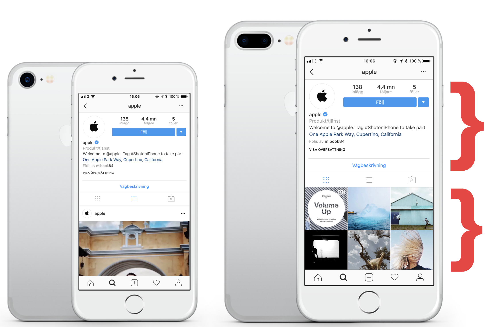
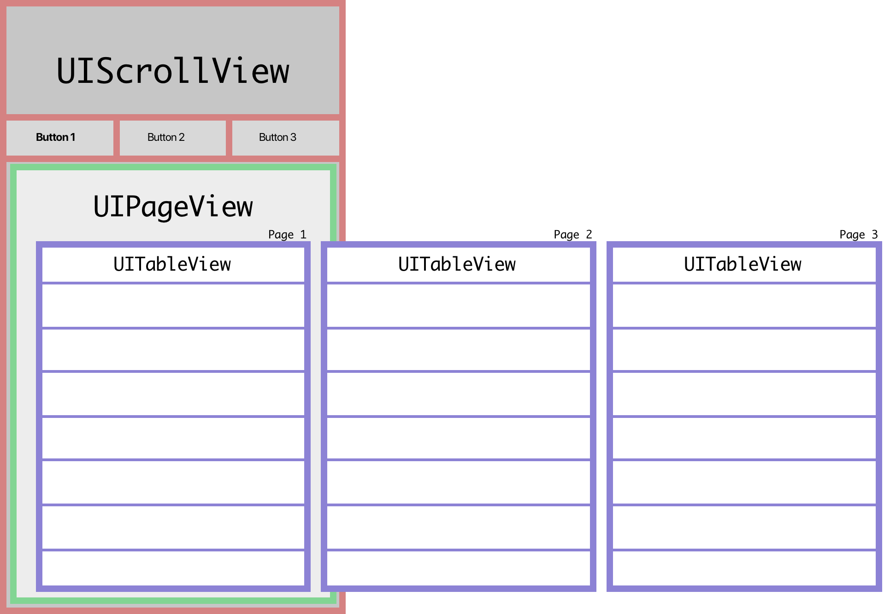
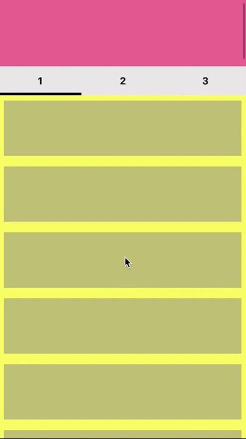
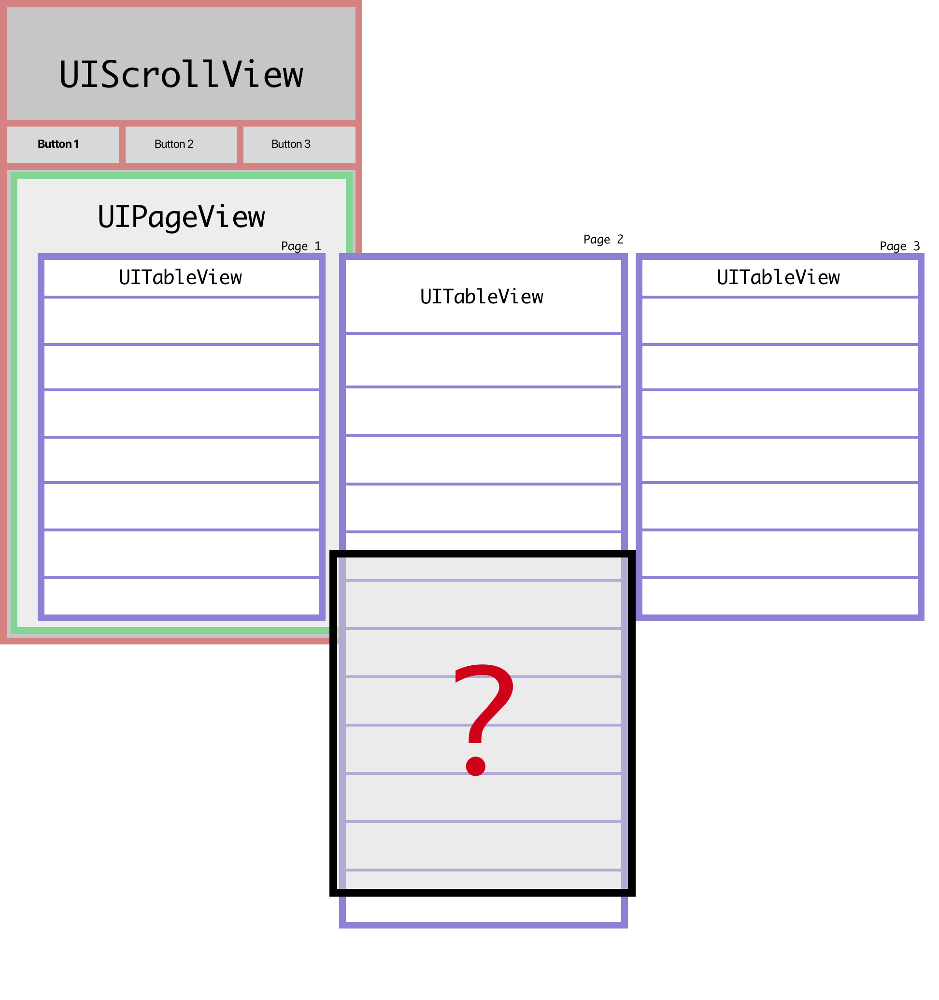

# InstaPage

Using XCode 9.3

A laboration in creating an Instagram account like view hierarchy. The Instagram account page consist of a header, tab buttons and some scrollable content view such as collection view or table view. When the user scrolls, the header go up off the screen no matter which tab you're on at the moment.

I had gotten some design for a project that looked just like the Instagram page, with the exeption that the user should be able to scroll between the tabs like a Page View Controller.
Here is a visual representation of what we wanted to achieve.

For my first attempt I choose to first enable scrolling in the UIScrollView until header is gone, then I set scrolling enabled on the UITableView. When UITableView is scrolled to the top I reverse the process. This however, obviously calls for a bad user experience.

For my second attempt I only allow scrolling in the UIScrollView. I change the content size of the scroll view depending on the content size of the table view. When user switch tab, the scroll view content size should change accordingly.

This works great except for one thing. When switching tab from one with long height to one with smaller there is obviously a mismatch. I guess this is why Instagram only allow tapping of the buttons to swtich between the collection/table views.

What I take from this laboration is that it is possible to switch between table views while still keep the header scrollable. However I don't see a good implementation of this if there should be swiping between the dynamic content. Both attempts are included in this repository. 
